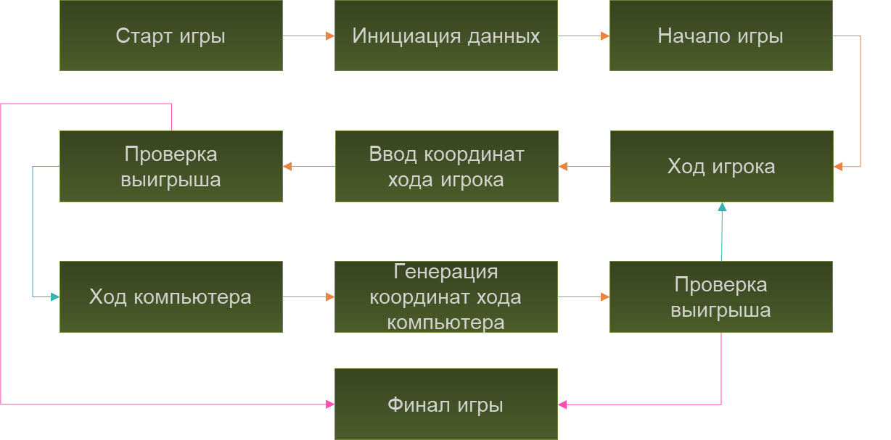
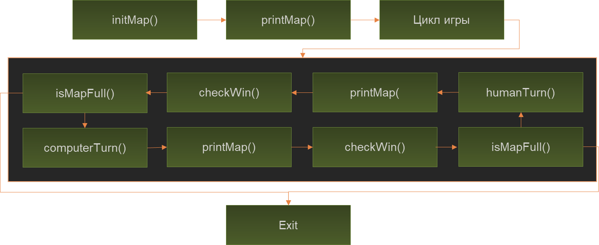
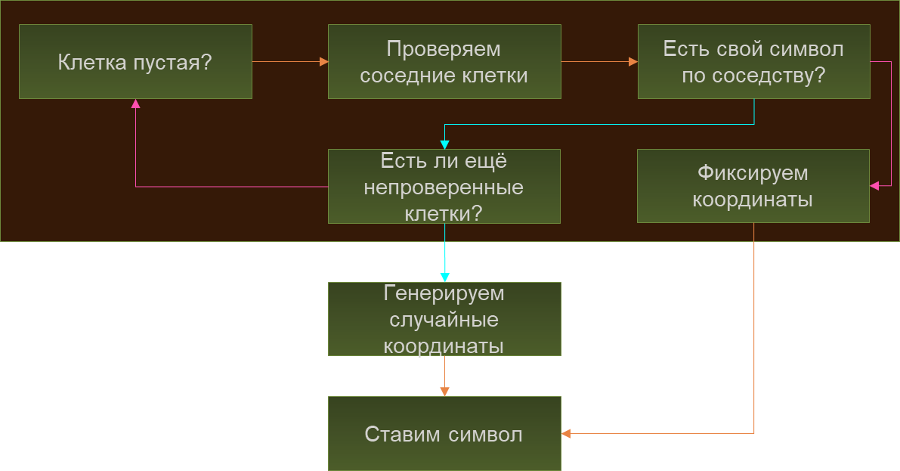

# Крестики-нолики. 

## Разработка алгоритма

### Начало разработки

Большинство игр подчиняются строгому алгоритму. Он ложится в основу кода при программировании игры для ее реализации на компьютере. Чтобы разработка была прозрачной, надо четко сформулировать принцип работы и последовательность действий.

Изобразим наш алгоритм в виде пошаговой схемы: 




Начинаем с запуска игры — по сути, это метод main в главном классе программы. Затем создаем поле игры, ее состояние, участников. Только после этого можно стартовать — предлагать первому игроку сделать ход в выбранную им ячейку.

Сам ход тоже будет состоять из нескольких шагов: считывания координат, проверки доступности ячейки и обновления поля. Затем нужно проверить поле на наличие выигрышной комбинации или ничьей. После этого передать ход другому игроку (компьютеру) или завершить игру. Видим, что она состоит из циклов, а каждый из них составляют фазы — ходы игроков.

Схема также показывает, что каждый ход будет менять у поля состояние, которое надо где-то хранить.

Проверку выигрыша для компьютера и реального игрока нет смысла разделять, так как логика аналогична — разница только в проверяемом символе игрока. Поле не бесконечно — игра кончится, когда будет заполнена последняя ячейка.

Ввиду этих фактов преобразуем схему в набор методов:




Игровое поле будет хранить состояние — **map**. Надо выводить его на экран в начале и конце игры, а также на каждой фазе ходов.

Если посмотреть на классическое игровое поле, сразу становится понятно, что состояние нужно хранить в виде двумерного массива размерностью 3 на 3 с типом **char**. Тогда ход игрока будет вводом двух координат выбранной ячейки — по горизонтали и вертикали. Для поля 3 на 3 будет 8 победных комбинаций.

В реализации игры помогут вспомогательные сущности — классы **Scanner** и **Random**. Первый будет обеспечивать удобную работу с пользовательским вводом координат, а второй — генерировать случайные числа для игры с простой версией противника-компьютера, который ходит в случайную незанятую ячейку. 

## Создание логики

### Базовая логика

Напишем основную логику, которая будет выполнять все действия, кроме хода компьютера. Это отдельная часть программы, которая требует особого внимания. 

Создав новый проект в **IDE**, добавим главный класс игры — **TickTackToe**. В нем будет метод **main**. Еще создадим переменные, присущие этому классу. 

-  **char[][] map** — матрица игры;
-  **int SIZE** — размерность поля;
-  **символы игры** — крестик, нолик и пустая клетка;
-  **экземпляр класса Scanner** для ввода.

Логика в данной версии игры будет делиться на методы, вызываемые из **main**:

1.  **initMap()** — инициализация состояния игры.
2.  **printMap()** — вывод поля на экран.
3.  **Псевдобесконечный цикл while(true)** — для хода игры:
   1.  **humanTurn()**;
   2.  **computerTurn()**.
4.  После каждой фазы проверяем завершение игры — **isEndGame()**. Это проверка любого условия выхода из игры.

### Инициация игры

Размещаем в поле игры массив **SIZE x SIZE**, после чего двойным циклом заполняем его пустыми символами. 

```java
private static void initMap() {
  map = new char[SIZE][SIZE];
  for(int i = 0; i < SIZE; i ++){
    for(int j = 0; j < SIZE; j++){
      map[i][j] = DOT_EMPTY;
    }
  }
}
```

### Вывод поля на экран

При показе поля на экране следует указывать номера строк и столбцов — это удобно. Поэтому понадобятся несколько циклов: один — для вывода «шапки», второй (двойной) — для поля. При этом в каждом шаге внешнего цикла вывода поля первым будет печататься номер строки.

```java
private static void printMap() {
  for(int i = 0; i <= SIZE; i++){
    System.out.print(i + " ");
  }
  System.out.println();

  for(int i =0; i < SIZE; i++){
    System.out.print((i+1) + " ");
    for(int j = 0; j < SIZE; j++){
      System.out.print(map[i][j] + " ");
    }
    System.out.println();
  }

  System.out.println();
}
```

Программа уже умеет начинать игру и печатать поле.

### Ход пользователя

Пользователь при ходе будет указывать две его координаты. 

Человек не всегда ходит правильно, поэтому надо предусмотреть на 100% корректный ход. Для проверки будем использовать цикл **do..while** — он гарантирует, что хотя бы одна проверка пройдет, а значит ход состоится. Пока координаты не станут корректными, цикл будет повторно запрашивать их у игрока. В проверке будет участвовать отдельный метод **isCellValid(x, y)**.

Игроку удобнее вводить номер строки или столбца при счете с единицы, тогда как компьютер начинает считать с 0. Учтем это при работе с пользовательским вводом и **scanner**.

```java
private static void humanTurn() {
  int x, y;
  do {
    System.out.println("Введите координаты ячейки (X Y)");
    y = scanner.nextInt() - 1; // Считывание номера строки
    x = scanner.nextInt() - 1; // Считывание номера столбца
  }
  while(!isCellValid(x, y));

  map[y][x] = DOT_X;
}
```

Когда получены корректные координаты, цикл завершается. Поэтому сразу после выхода можно обновить состояние игры, проставив в соответствующую ячейку массива символ игрока.

### Проверка корректности хода

Метод проверки будет иметь булевский тип, что позволит удобно использовать его в условиях **if**.

Ход будет некорректен, когда он делается вне поля или в занятую ячейку. Это легко задать в условиях простыми сравнениями. В случае проверки выхода за границы поля используем комбинацию условий через логическое **ИЛИ**. Если хотя бы одно условие выполнится, вся конструкция вернет **true**, а результат превратится в **false**.

```java
public static boolean isCellValid(int x, int y){
  boolean result = true;

  if(x < 0 || x >= SIZE || y < 0 || y >= SIZE) {
    result = false;
  }

  if(map[y][x] != DOT_EMPTY){
    result = false;
  }

  return result;
}
```

### Проверка завершения игры

Остается добавить метод проверки завершения. Для этого выведем игроку поле, чтобы было понятно, что он сделал ход, куда хотел. Затем проверим условие победы и ничьей. Если один из этих методов вернет истину, завершим игру. 

Чтобы проверить заполненность поля, проходим по нему, пока не найдем первый пустой символ. Если хотя бы одна ячейка пустует, поле еще не заполнено.

```java
public static boolean isCellValid(int x, int y){
  boolean result = true;

  if(x < 0 || x >= SIZE || y < 0 || y >= SIZE) {
    result = false;
  }

  if(map[y][x] != DOT_EMPTY){
    result = false;
  }

  return result;
}
```

Проверка победы реализуется «в лоб» — перечислением восьми комбинаций. Это три одинаковых символа в одном из 8 возможных выигрышных вариантов.``

```java
private static boolean checkWin(char playerSymbol) {
  boolean result = false;

  if(
    (map[0][0] == playerSymbol && map[0][1] == playerSymbol && map[0][2] == playerSymbol) ||
    (map[1][0] == playerSymbol && map[1][1] == playerSymbol && map[1][2] == playerSymbol) || 
    (map[2][0] == playerSymbol && map[2][1] == playerSymbol && map[2][2] == playerSymbol) ||
    (map[0][0] == playerSymbol && map[1][0] == playerSymbol && map[2][0] == playerSymbol) ||
    (map[0][1] == playerSymbol && map[1][1] == playerSymbol && map[2][1] == playerSymbol) ||
    (map[0][2] == playerSymbol && map[1][2] == playerSymbol && map[2][2] == playerSymbol) ||
    (map[0][0] == playerSymbol && map[1][1] == playerSymbol && map[2][2] == playerSymbol) ||
    (map[2][0] == playerSymbol && map[1][1] == playerSymbol && map[0][2] == playerSymbol)){
    result = true;
  }
  return result;
}
```

## Генерация координат хода компьютера

«Глупый» компьютер будет ставить свои символы в ячейки случайным образом при помощи класса **java.util.Random**. Для этого потребуется как минимум экземпляр этого класса.

```java
private static Random random = new Random();
```

В методе хода компьютера — по аналогии с методом хода игрока — будут нужны две координаты. Поскольку машина будет генерировать свой ход случайно, удобно задать этим координатам заведомо некорректные значения. Потом в цикле будем присваивать уже реальные значения, которые можно проверять на корректность.

Поэтому генерацию координат будем делать тоже через **do..while**.

Для прозрачности можно добавить и оповещения для пользователя, что компьютер выбрал ту или иную ячейку. 

```java
private static void computerTurn(){
  int x = -1;
  int y = -1;

  if(SILLY_MODE){
    do {
      x = random.nextInt(SIZE);
      y = random.nextInt(SIZE);
    } while(!isCellValid(x, y));
  }
  else{
    for(int i = 0; i < SIZE; i++){
      for(int j = 0; j < SIZE; j++){
        // Проверяем клетки по направлениям
      }
    }
  }

  System.out.println("Компьютер выбрал ячейку " + (y + 1) + " " + (x + 1));
  map[y][x] = DOT_O;
}
```

В самом методе хода оставим «вилку» для усложненной логики, которую вам нужно будет реализовать в домашнем задании.

Алгоритмов очень много — например, стратегия Минимакса. Для реализации на нынешнем уровне знания языка применим алгоритм, диктующий компьютеру ставить свои символы в ту клетку, где по соседству уже есть его отметки. Опишем это схемой шагов:



Также можно просчитать «выгодность» клетки, ее рейтинг, выраженный в количестве соседних клеток, которые будут для компьютера «своими». Пройти поле можно двумя итерациями, что уже реализовано в приведенном выше листинге.

***Подсказка*** *для домашнего задания, где много работы с вложенными циклами: конструкция* ***break*** *прерывает только один цикл!*